# System Architecture

## Overview

Nexum is built on a modular architecture that follows core banking principles while maintaining flexibility and scalability. Each module has clear responsibilities and well-defined interfaces, making the system maintainable and extensible.

## Core Principles

### 1. Double-Entry Accounting
Every financial transaction creates balanced journal entries where total debits equal total credits. This ensures data integrity and provides a complete audit trail.

### 2. Immutable Audit Trail
All operations are recorded in a hash-chained audit log using SHA-256 hashing. Each audit entry contains a hash of the previous entry, making tampering detectable.

### 3. Decimal Precision
All monetary calculations use Python's `decimal.Decimal` type to avoid floating-point precision errors. This is critical for financial accuracy.

### 4. Event Sourcing
Account balances are derived from journal entries rather than stored as mutable values. This provides complete transaction history and makes the system resilient to corruption.

## Module Dependencies

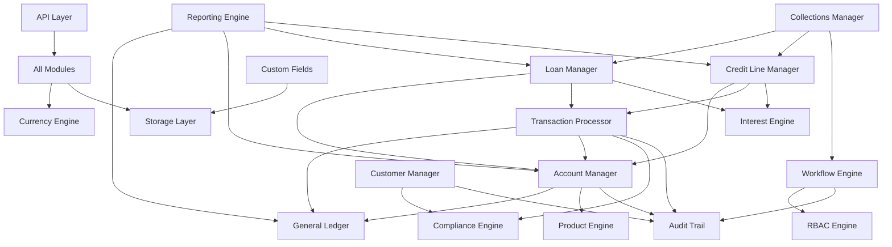

## Data Flow

### Transaction Processing Flow

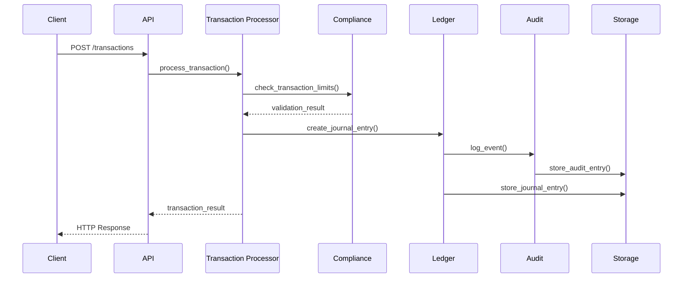

### ACID Transaction Flow

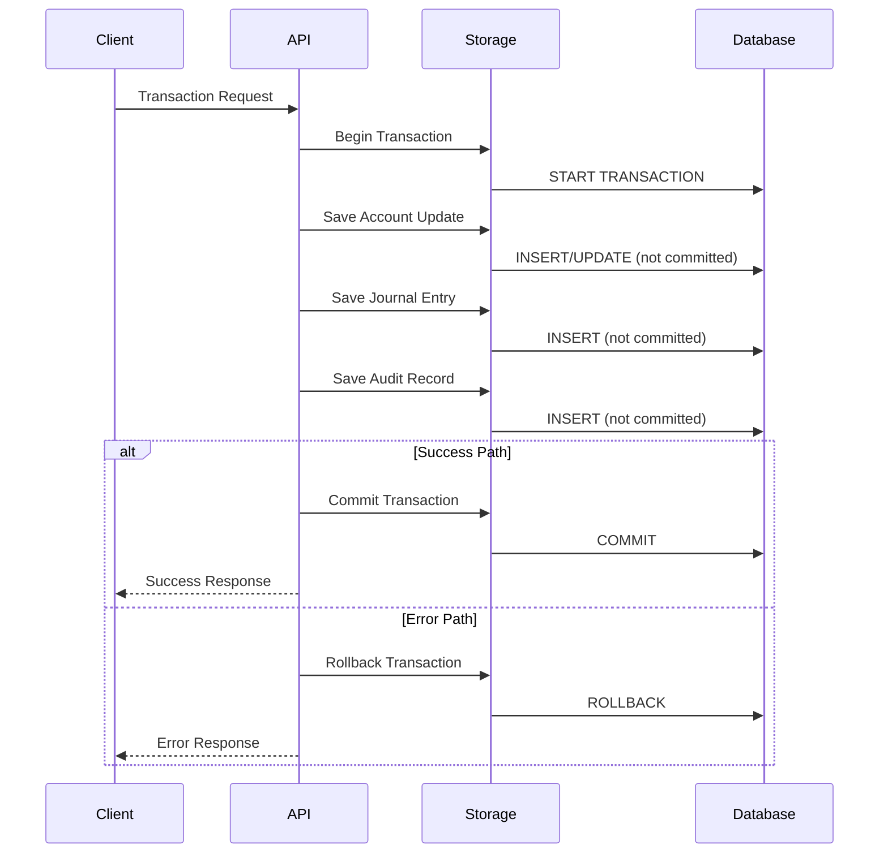

### Atomic Operations with Context Manager

```python
# All critical operations use atomic context manager
with storage.atomic():
    # Account balance update
    storage.save('accounts', account_id, updated_account)
    
    # Journal entry creation
    storage.save('journal_entries', entry_id, journal_entry)
    
    # Audit trail logging
    storage.save('audit_logs', audit_id, audit_entry)
    
    # If any operation fails, all are rolled back automatically
```

### Account Balance Calculation

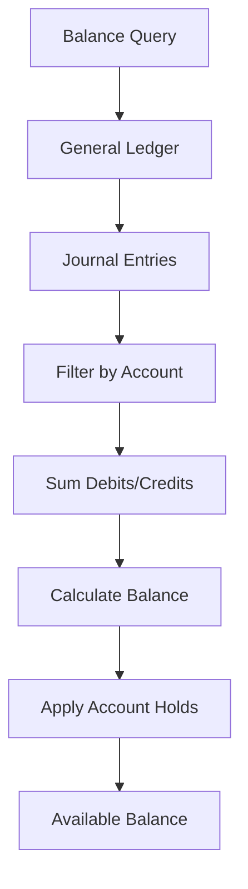

## Storage Architecture

### Storage Layer Diagram

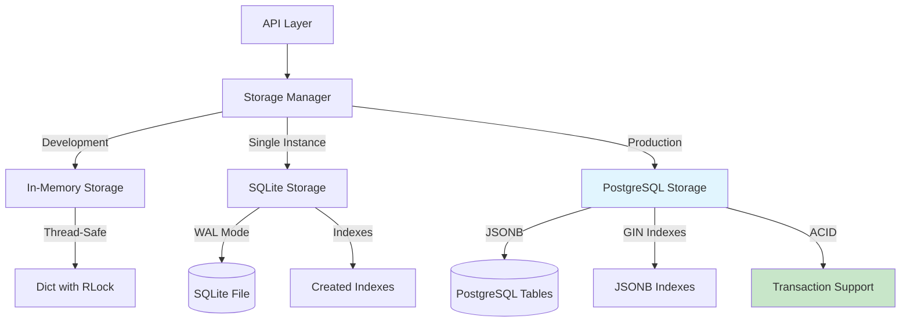

## Phase 2 Architecture Enhancements

### Multi-Tenancy Layer

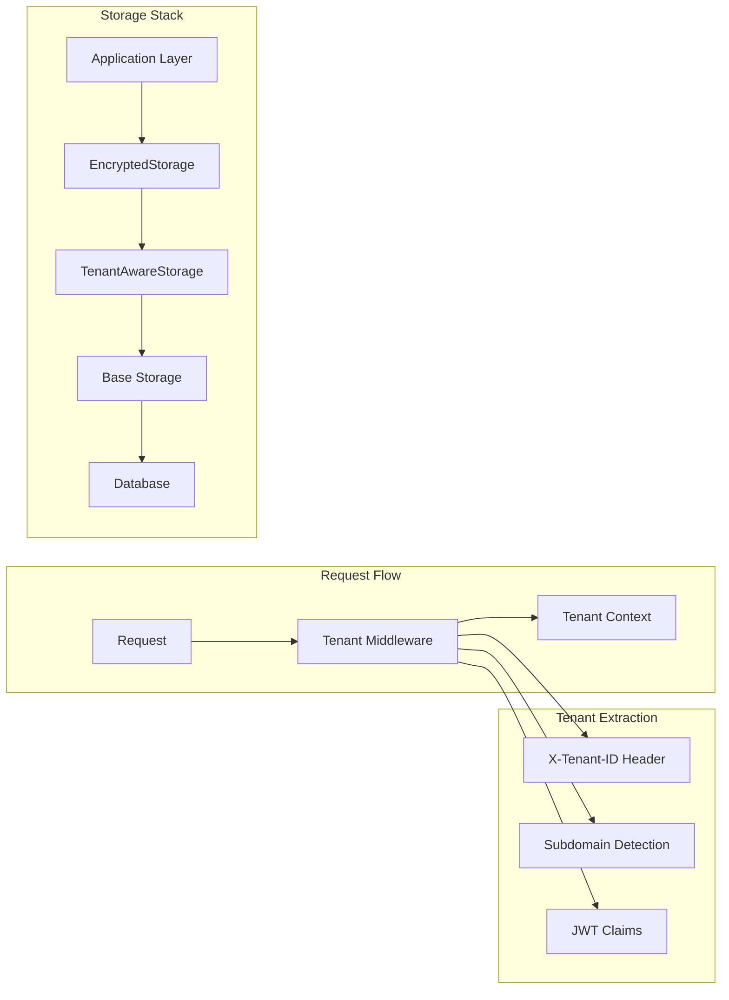

### Event-Driven Architecture (Observer Pattern)

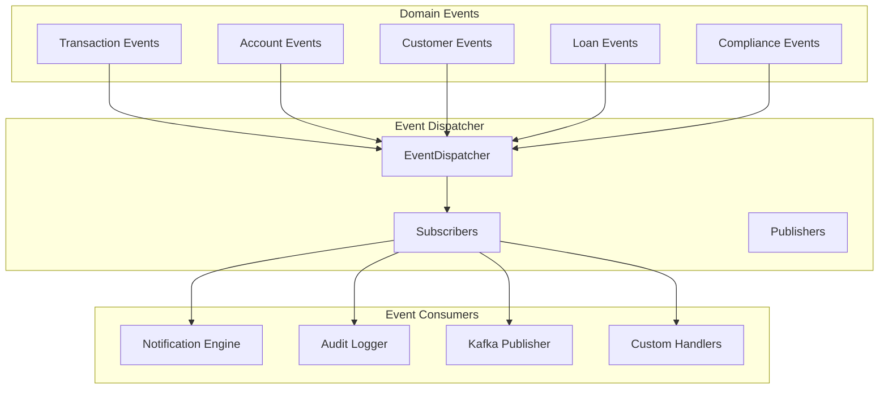

### Notification Engine Flow

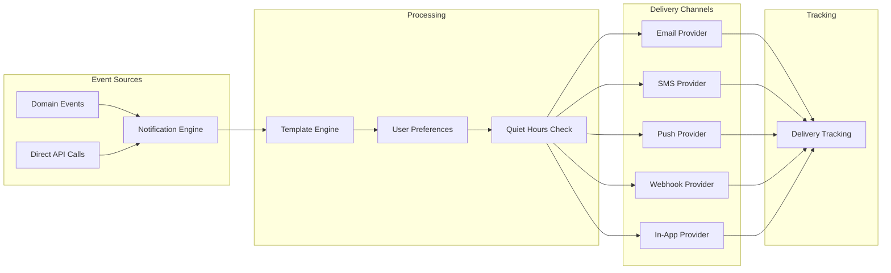

### Encryption Layer Architecture

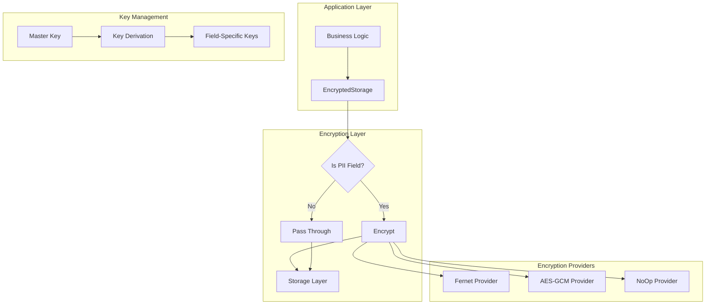

### Full Storage Stack

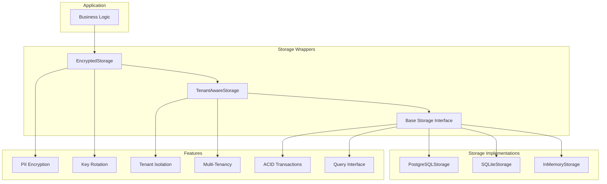

### Storage Abstraction
The storage layer provides a pluggable interface supporting multiple backends:

- **In-Memory**: Thread-safe dictionary storage for testing and development
- **SQLite**: WAL mode with automatic indexing for single-instance deployments  
- **PostgreSQL**: JSONB storage with GIN indexes for production deployments

### PostgreSQL Implementation Features

- **JSONB Storage**: Native JSON storage with indexing and query optimization
- **ACID Transactions**: Full transaction support with rollback capabilities
- **GIN Indexes**: Fast queries on JSON document fields
- **Connection Pooling**: Managed connections with automatic reconnection
- **Migration System**: Versioned schema changes with rollback support

### Data Persistence
```python
# Storage Interface
class StorageInterface:
    def store(self, record: StorageRecord) -> str
    def retrieve(self, key: str) -> Optional[StorageRecord]
    def query(self, filters: Dict[str, Any]) -> List[StorageRecord]
    def update(self, key: str, record: StorageRecord) -> bool
    def delete(self, key: str) -> bool
```

## Security Model

### Hash-Chained Audit Trail
```python
# Each audit entry contains:
@dataclass
class AuditEntry:
    id: str                    # Unique identifier
    timestamp: datetime        # UTC timestamp
    event_type: AuditEventType # Type of operation
    entity_id: str            # Target entity
    user_id: Optional[str]    # User who performed action
    details: Dict[str, Any]   # Event details
    previous_hash: str        # Hash of previous entry
    current_hash: str         # SHA-256 of this entry
```

### Authentication Middleware Flow

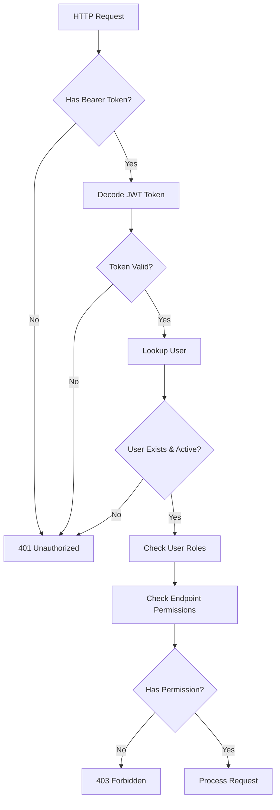

### JWT Token Structure

```python
# JWT Payload
{
    "sub": "user_id",           # Subject (user ID)  
    "username": "admin",        # Username
    "roles": ["admin"],         # User roles
    "exp": 1735689600,         # Expiration timestamp
    "iat": 1735603200,         # Issued at timestamp
    "session_id": "sess_123"    # Session identifier
}
```

### Role-Based Access Control (RBAC)

```python
# 8 Built-in Roles:
SUPER_ADMIN    # Full system access
ADMIN          # Administrative operations
MANAGER        # Department management
OFFICER        # Daily operations
TELLER         # Basic transactions
COMPLIANCE     # Compliance operations
AUDITOR        # Read-only access
GUEST          # Limited read access

# 30 Permissions covering all operations
CREATE_ACCOUNT, VIEW_ACCOUNT, MODIFY_ACCOUNT,
CREATE_TRANSACTION, APPROVE_TRANSACTION, REVERSE_TRANSACTION,
CREATE_LOAN, APPROVE_LOAN, DISBURSE_LOAN,
# ... and more
```

## Performance Considerations

### Database Optimization
- Indexed queries for account lookups
- Partitioned tables for large transaction volumes
- Connection pooling for concurrent access

### Caching Strategy
- Account balance caching with invalidation
- Product configuration caching
- User session and permission caching

### Scalability Patterns
- Horizontal scaling through database sharding
- Microservice decomposition for high-volume operations
- Event streaming for real-time processing

## Integration Points

### Modular API Structure

```mermaid
flowchart TD
    MAIN_API[Main API Server] --> ROUTER_INCLUDE[Include Routers]
    
    ROUTER_INCLUDE --> AUTH_ROUTER[auth.py - Authentication]
    ROUTER_INCLUDE --> CUST_ROUTER[customers.py - Customer Management]
    ROUTER_INCLUDE --> ACCT_ROUTER[accounts.py - Account Operations]
    ROUTER_INCLUDE --> TXN_ROUTER[transactions.py - Transactions]
    ROUTER_INCLUDE --> LOAN_ROUTER[loans.py - Loan Management] 
    ROUTER_INCLUDE --> CREDIT_ROUTER[credit.py - Credit Lines]
    ROUTER_INCLUDE --> KAFKA_ROUTER[kafka.py - Event Streaming]
    ROUTER_INCLUDE --> ADMIN_ROUTER[admin.py - Administration]
    
    AUTH_ROUTER --> AUTH_ENDPOINTS[/auth/login, /auth/logout, /auth/refresh]
    CUST_ROUTER --> CUST_ENDPOINTS[/customers, /customers/{id}/kyc]
    ACCT_ROUTER --> ACCT_ENDPOINTS[/accounts, /accounts/{id}/balance]
    TXN_ROUTER --> TXN_ENDPOINTS[/transactions/deposit, /transactions/transfer]
    LOAN_ROUTER --> LOAN_ENDPOINTS[/loans, /loans/{id}/payment]
    CREDIT_ROUTER --> CREDIT_ENDPOINTS[/credit/{id}/draw, /credit/{id}/payment]
    KAFKA_ROUTER --> KAFKA_ENDPOINTS[/kafka/status, /kafka/events]
    ADMIN_ROUTER --> ADMIN_ENDPOINTS[/admin/users, /admin/system]
```

### API Router Architecture

```python
# Main API application
app = FastAPI(
    title="Nexum Core Banking API", 
    version="1.0.0",
    description="Production-grade core banking system"
)

# Include modular routers
app.include_router(auth.router, prefix="/auth", tags=["Authentication"])
app.include_router(customers.router, prefix="/customers", tags=["Customers"])
app.include_router(accounts.router, prefix="/accounts", tags=["Accounts"])
app.include_router(transactions.router, prefix="/transactions", tags=["Transactions"])
app.include_router(loans.router, prefix="/loans", tags=["Loans"])
app.include_router(credit.router, prefix="/credit", tags=["Credit"])
app.include_router(kafka.router, prefix="/kafka", tags=["Events"])
app.include_router(admin.router, prefix="/admin", tags=["Administration"])
```

### Middleware Stack

```python
# Security middleware
app.add_middleware(JWTAuthenticationMiddleware)
app.add_middleware(RateLimitingMiddleware, requests_per_minute=60)

# CORS middleware for web clients  
app.add_middleware(CORSMiddleware, allow_origins=["*"])

# Logging middleware
app.add_middleware(StructuredLoggingMiddleware)
```

### Kafka Event Flow Diagram

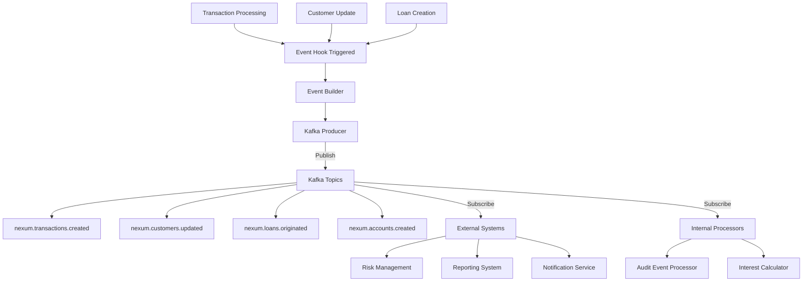

### Event Message Format (CloudEvents Compatible)

```json
{
  "specversion": "1.0",
  "type": "nexum.transactions.created",
  "source": "nexum-core-banking",
  "id": "txn_abc123def456",
  "time": "2026-02-19T15:32:00.000000Z",
  "datacontenttype": "application/json",
  "subject": "transaction/txn_abc123def456",
  "data": {
    "transaction_id": "txn_abc123def456",
    "account_id": "acc_xyz789ghi012", 
    "amount": "1000.00",
    "currency": "USD",
    "transaction_type": "deposit",
    "status": "completed"
  }
}
```

### External System Integration
- **Payment Processors**: ACH, wire transfers, card networks
- **Regulatory Reporting**: Automated compliance reporting
- **Risk Management**: Real-time fraud detection via Kafka events
- **Customer Channels**: Web, mobile, ATM integration
- **Event Streaming**: Real-time event publishing to downstream systems

## Deployment Architecture

### Single Instance Deployment
```
┌─────────────────┐
│   Load Balancer │
└─────────────────┘
         │
┌─────────────────┐
│   Nexum API     │
│   (FastAPI)     │
└─────────────────┘
         │
┌─────────────────┐
│   SQLite DB     │
└─────────────────┘
```

### Production Deployment
```
┌─────────────────┐    ┌─────────────────┐
│   Load Balancer │────│   Load Balancer │
└─────────────────┘    └─────────────────┘
         │                       │
┌─────────────────┐    ┌─────────────────┐
│   Nexum API     │    │   Nexum API     │
│   Instance 1    │    │   Instance 2    │
└─────────────────┘    └─────────────────┘
         │                       │
         └───────┬───────────────┘
                 │
    ┌─────────────────┐    ┌─────────────────┐
    │   PostgreSQL    │────│   PostgreSQL    │
    │   Primary       │    │   Replica       │
    └─────────────────┘    └─────────────────┘
```

## Error Handling

### Exception Hierarchy
```python
class NexumException(Exception):
    """Base exception for all Nexum errors"""

class InsufficientFundsError(NexumException):
    """Raised when account has insufficient funds"""

class ComplianceViolationError(NexumException):
    """Raised when transaction violates compliance rules"""

class AuditIntegrityError(NexumException):
    """Raised when audit trail integrity is compromised"""
```

### Idempotency Handling
All transaction endpoints support idempotency keys to prevent duplicate processing:

```python
@app.post("/transactions")
async def create_transaction(
    request: CreateTransactionRequest,
    idempotency_key: Optional[str] = Header(None)
):
    # Duplicate detection and handling
    if idempotency_key and transaction_exists(idempotency_key):
        return get_existing_transaction(idempotency_key)
```

## Monitoring and Observability

### Health Checks
- `/health` - Basic system health
- `/health/detailed` - Component-level health status

### Metrics Collection
- Transaction volumes and rates
- Account balance changes
- Interest calculations
- Compliance check results
- API response times

### Audit and Compliance
- Complete transaction audit trail
- Regulatory reporting capabilities
- Suspicious activity monitoring
- Data retention policies