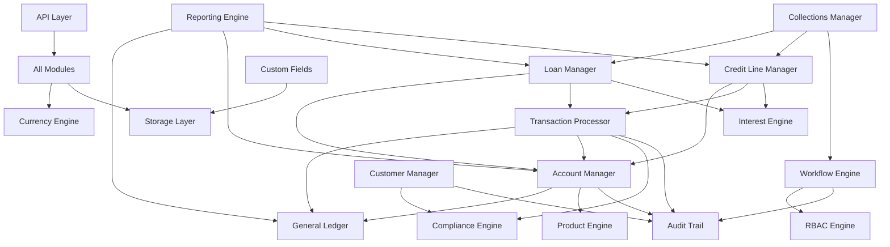
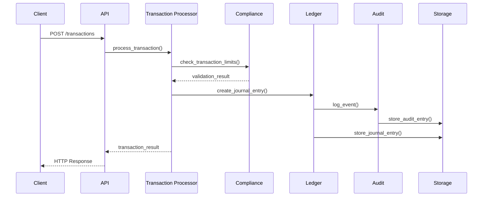
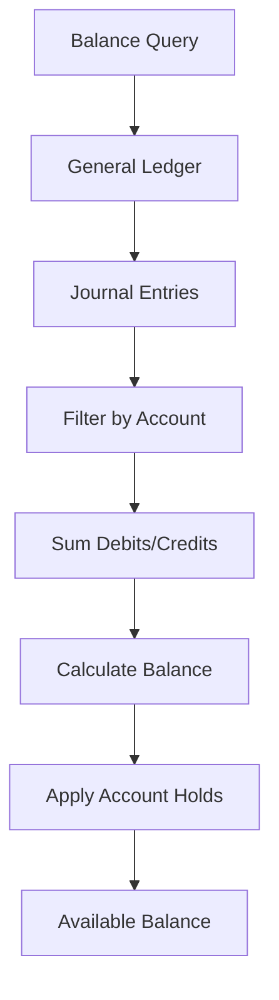

# System Architecture

## Overview

Nexum is built on a modular architecture that follows core banking principles while maintaining flexibility and scalability. Each module has clear responsibilities and well-defined interfaces, making the system maintainable and extensible.

## Core Principles

### 1. Double-Entry Accounting
Every financial transaction creates balanced journal entries where total debits equal total credits. This ensures data integrity and provides a complete audit trail.

### 2. Immutable Audit Trail
All operations are recorded in a hash-chained audit log using SHA-256 hashing. Each audit entry contains a hash of the previous entry, making tampering detectable.

### 3. Decimal Precision
All monetary calculations use Python's `decimal.Decimal` type to avoid floating-point precision errors. This is critical for financial accuracy.

### 4. Event Sourcing
Account balances are derived from journal entries rather than stored as mutable values. This provides complete transaction history and makes the system resilient to corruption.

## Module Dependencies



## Data Flow

### Transaction Processing Flow



### Account Balance Calculation



## Storage Architecture

### Storage Abstraction
The storage layer provides a pluggable interface supporting multiple backends:

- **In-Memory**: For testing and development
- **SQLite**: For single-instance deployments
- **PostgreSQL**: For production deployments (ready to implement)

### Data Persistence
```python
# Storage Interface
class StorageInterface:
    def store(self, record: StorageRecord) -> str
    def retrieve(self, key: str) -> Optional[StorageRecord]
    def query(self, filters: Dict[str, Any]) -> List[StorageRecord]
    def update(self, key: str, record: StorageRecord) -> bool
    def delete(self, key: str) -> bool
```

## Security Model

### Hash-Chained Audit Trail
```python
# Each audit entry contains:
@dataclass
class AuditEntry:
    id: str                    # Unique identifier
    timestamp: datetime        # UTC timestamp
    event_type: AuditEventType # Type of operation
    entity_id: str            # Target entity
    user_id: Optional[str]    # User who performed action
    details: Dict[str, Any]   # Event details
    previous_hash: str        # Hash of previous entry
    current_hash: str         # SHA-256 of this entry
```

### Role-Based Access Control (RBAC)
```python
# 8 Built-in Roles:
SUPER_ADMIN    # Full system access
ADMIN          # Administrative operations
MANAGER        # Department management
OFFICER        # Daily operations
TELLER         # Basic transactions
COMPLIANCE     # Compliance operations
AUDITOR        # Read-only access
GUEST          # Limited read access

# 30 Permissions covering all operations
```

## Performance Considerations

### Database Optimization
- Indexed queries for account lookups
- Partitioned tables for large transaction volumes
- Connection pooling for concurrent access

### Caching Strategy
- Account balance caching with invalidation
- Product configuration caching
- User session and permission caching

### Scalability Patterns
- Horizontal scaling through database sharding
- Microservice decomposition for high-volume operations
- Event streaming for real-time processing

## Integration Points

### API Gateway Integration
```python
# FastAPI with automatic OpenAPI generation
app = FastAPI(
    title="Nexum Core Banking API",
    version="1.0.0",
    description="Production-grade core banking system"
)

# CORS middleware for web clients
app.add_middleware(CORSMiddleware, allow_origins=["*"])
```

### External System Integration
- **Payment Processors**: ACH, wire transfers, card networks
- **Regulatory Reporting**: Automated compliance reporting
- **Risk Management**: Real-time fraud detection
- **Customer Channels**: Web, mobile, ATM integration

## Deployment Architecture

### Single Instance Deployment
```
┌─────────────────┐
│   Load Balancer │
└─────────────────┘
         │
┌─────────────────┐
│   Nexum API     │
│   (FastAPI)     │
└─────────────────┘
         │
┌─────────────────┐
│   SQLite DB     │
└─────────────────┘
```

### Production Deployment
```
┌─────────────────┐    ┌─────────────────┐
│   Load Balancer │────│   Load Balancer │
└─────────────────┘    └─────────────────┘
         │                       │
┌─────────────────┐    ┌─────────────────┐
│   Nexum API     │    │   Nexum API     │
│   Instance 1    │    │   Instance 2    │
└─────────────────┘    └─────────────────┘
         │                       │
         └───────┬───────────────┘
                 │
    ┌─────────────────┐    ┌─────────────────┐
    │   PostgreSQL    │────│   PostgreSQL    │
    │   Primary       │    │   Replica       │
    └─────────────────┘    └─────────────────┘
```

## Error Handling

### Exception Hierarchy
```python
class NexumException(Exception):
    """Base exception for all Nexum errors"""

class InsufficientFundsError(NexumException):
    """Raised when account has insufficient funds"""

class ComplianceViolationError(NexumException):
    """Raised when transaction violates compliance rules"""

class AuditIntegrityError(NexumException):
    """Raised when audit trail integrity is compromised"""
```

### Idempotency Handling
All transaction endpoints support idempotency keys to prevent duplicate processing:

```python
@app.post("/transactions")
async def create_transaction(
    request: CreateTransactionRequest,
    idempotency_key: Optional[str] = Header(None)
):
    # Duplicate detection and handling
    if idempotency_key and transaction_exists(idempotency_key):
        return get_existing_transaction(idempotency_key)
```

## Monitoring and Observability

### Health Checks
- `/health` - Basic system health
- `/health/detailed` - Component-level health status

### Metrics Collection
- Transaction volumes and rates
- Account balance changes
- Interest calculations
- Compliance check results
- API response times

### Audit and Compliance
- Complete transaction audit trail
- Regulatory reporting capabilities
- Suspicious activity monitoring
- Data retention policies